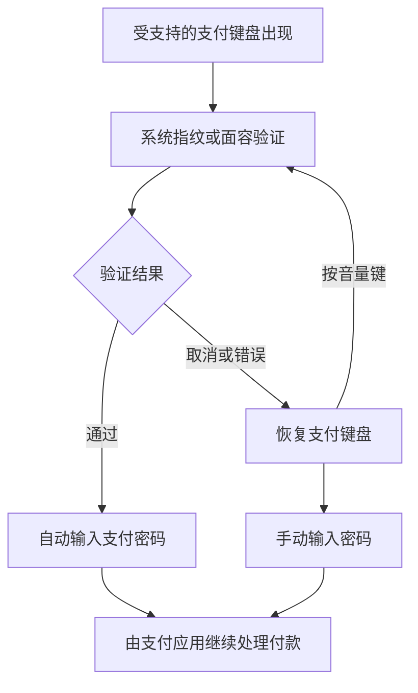

<h1>BioPay</h1>

让支付应用轻松接入系统原生生物认证。

## 项目简介

**BioPay** 支持微信、支付宝、淘宝、QQ 和云闪付。在受支持的支付密码页，它调用 Android 系统生物认证；验证成功后，自动输入预先保存的六位支付密码。

各应用的密码和设置相互独立。微信内付款及其他应用调起的微信支付使用微信适配；其余应用按各自的页面和键盘识别，实际支持范围会随支付应用版本变化。

## 支持应用与设置入口

| 应用名称 | 在哪里打开 BioPay 设置 |
| --- | --- |
| 微信 | 聊天页右上角 "+" 菜单 → "生物支付" |
| QQ | 聊天页右上角 "+" 菜单 → "生物支付" |
| 支付宝 | 我的 → 设置 → 支付设置 → 生物支付 |
| 淘宝 | 我的 → 设置 → 生物支付 |
| 云闪付 | 我的 → 设置 → 生物支付 |

入口位置可能随支付应用更新而变化。各版本 APK 的功能范围以对应的 [发行说明](https://github.com/kiriashi/BioPay/releases) 为准。

## 支付流程

识别未通过时，可以继续尝试。BioPay 只协助输入密码，最终支付结果以支付应用提示为准。

## 安装与设置

**需要：** Android 10+ 版本、支持 LibXposed API 102 的 LSPosed，以及设备上已录入指纹或面容。

1. 从 [Releases](https://github.com/kiriashi/BioPay/releases)或 **模块仓库** 下载并安装 APK。
2. 在 LSPosed 中启用 BioPay，勾选需要使用的支付应用作用域。
3. 强制停止选中的应用，再重新打开。
4. 按上表进入相应应用的 BioPay 设置页。
5. 按需选择验证方式并设置支付密码，按提示完成系统验证并保存。
6. 下次付款时，按系统提示验证即可。

### 面容支持范围

BioPay 通过 Android 的 **BiometricPrompt** 调用指纹或面容。部分设备的面容传感器属于 **Class 1**（便利级），系统不允许它通过 BiometricPrompt 用于应用认证；BioPay 目前无法使用这类面容传感器，可改用指纹或手动输入密码。

## 日常使用

- **切换验证方式：** 在对应应用的设置页调整指纹和面容开关，按提示验证后保存。已有密码时无需再次输入。
- **临时手动输入：** 点击取消验证按钮，或使用系统的导航栏按钮/手势返回。
- **重新验证：** 在支付键盘显示时按一次音量键可切换到生物认证页面。
- **关闭功能：** 在设置页关闭指纹和面容开关后保存，或是直接取消该应用的作用域勾选。
- **清除密码：** 长按设置页的清除按钮，按提示完成验证后清除。

## 隐私与安全

- BioPay 只声明一个 **使用生物特征硬件** 权限，不会申请其它网络、剪贴板等任何非必要权限。
- 模块也不收集、上传支付密码和生物信息，指纹和面容的识别都交由 Android 系统完成。
- 支付密码使用 AES-256-GCM 加密保存于本地，密钥由安卓 Keystore 统一管理，硬件保护能力取决于设备。
- 支付密码不会明文落盘，认证通过后才解密用于输入，使用后自动清理明文缓冲区。

## 反馈与贡献

**问题反馈（Issue）**：
如果遇到 Bug 或有功能建议，欢迎提交 Issue。提交前请按以下步骤操作：
1. 卸载正式版，从 [Release 工作流的 Artifacts](https://github.com/kiriashi/BioPay/actions/workflows/release.yml) 下载最新的 `Debug`，安装并进行一遍问题复现。
2. 在对应应用中打开「模块设置 → 异常诊断 → 导出」生成诊断日志，日志不会涉及任何个人敏感信息。
3. 提交 Issue 时，请附上复现步骤、诊断日志，以及系统版本、支付应用版本与 BioPay 版本。

**代码贡献（PR）**：
如果您已有改进方案，也欢迎提交 Pull Request！无论是修复 Bug、优化现有逻辑，还是实现新功能。

## 致谢

* [FingerprintPay](https://github.com/eritpchy/FingerprintPay)
* [LSPosed](https://github.com/LSPosed/LSPosed)

## 开源协议与免责声明

Copyright (C) 2026 kiriashi。项目以 [GNU Affero General Public License v3.0 或更新版本](LICENSE) 开源，修改和再分发须遵守该协议。

请仅在自己有权使用和修改的设备、账号上使用，并遵守相关法律及平台规则。本项目不提供任何担保；使用产生的账号、数据或支付风险由使用者自行承担。
